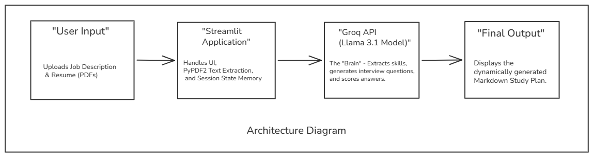

# AI-Powered Skill Assessment Agent

**Live Deployment:** [https://aiskillassess.streamlit.app/](https://aiskillassess.streamlit.app/)

## Overview
The AI-Powered Skill Assessment Agent is an automated human resources screening application. It evaluates candidate resumes against specific job descriptions, conducts a dynamic technical interview, scores responses, and generates targeted upskilling plans based on identified knowledge gaps.

## System Architecture

* **Frontend Framework & State Management:** Streamlit
* **Large Language Model (LLM):** Groq API (Meta Llama 3.1 8B)
* **Document Parsing:** PyPDF2

## Application Workflow

### 1. Document Extraction and Parsing
* **Inputs:** Job Description and Candidate Resume (PDF or plaintext).
* **Process:** The LLM processes the documents using strict JSON-schema constraints to identify the target role, required technical skills, and the intersection of skills present in the candidate's resume.

### 2. Dynamic Interview Generation
* **Process:** The application leverages Streamlit's session state to manage a multi-turn interview loop without redundant API calls. 
* **Execution:** For up to three identified skills, the LLM generates a single, scenario-based technical question tailored to the specified role.

### 3. Evaluation and Reporting
* **Scoring:** The LLM evaluates the candidate's submitted answers based on technical accuracy and depth, returning a JSON object with a numerical score (1-5) and specific feedback.
* **Reporting:** The system aggregates the evaluation data and generates a structured, Markdown-formatted study plan prioritizing the areas where the candidate demonstrated weakness.

## Local Setup Instructions

1. Clone the repository:
  git clone https://github.com/prat181/ai-skill-assessor.git
cd ai-skill-assessor
